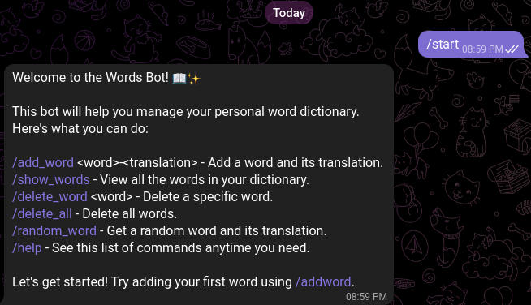

# New Words Telegram Bot

### This Telegram bot is designed to assist in learning new words. It's a valuable tool for language learning, term memorization, and more.

## 🛠 Technology Stack

## Features

- Add new words to a dictionary.
- Retrieve a random word from the dictionary.
-Ability to clear some words or all words from the dictionary.

## Installation

For detailed installation and running instructions, please refer to the [SETUP.md](SETUP.md) file.

## License

This project is licensed under the MIT License - see the [LICENSE](LICENSE) file for details.
